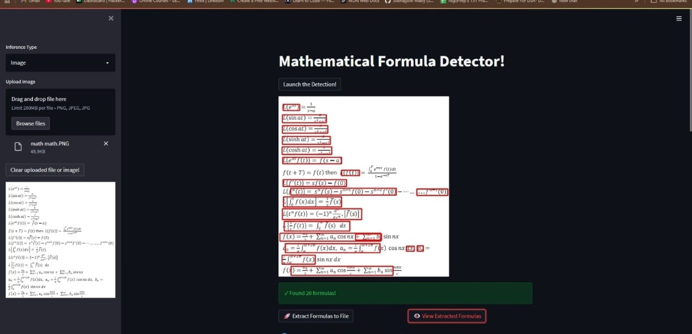
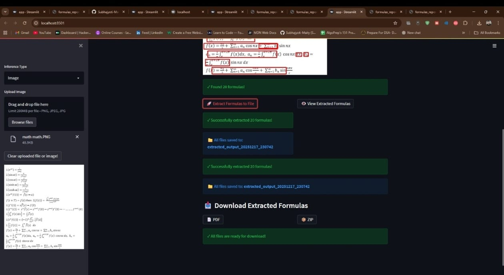
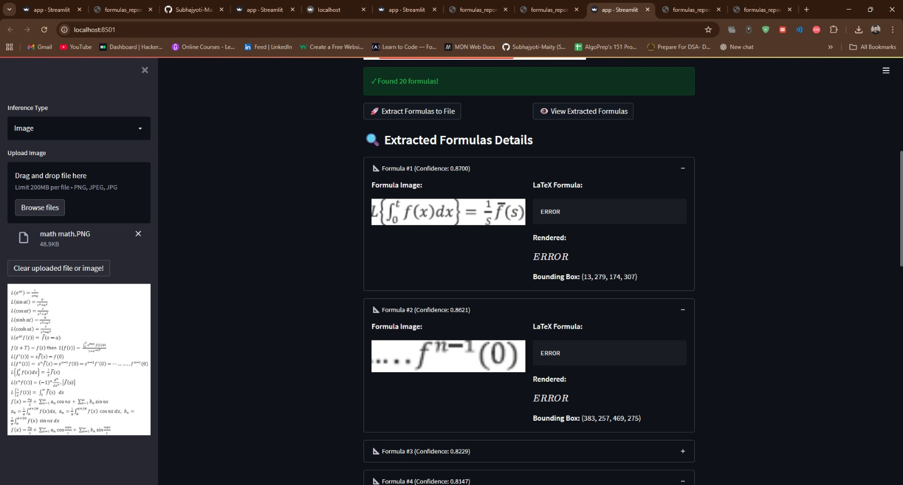

# Math Formula Detection

As large amounts of technical documents have been published in recent years, efficiently retrieving relevant documents and identifying locations of targeted terms are urgently needed.

## 📋 Overview

This project provides an end-to-end system that automatically detects and extracts mathematical formulas from printed documents. It combines YOLOv5-based object detection with formula recognition to identify formula locations and generate their LaTeX representations.

---

## 🤖 Model

We propose an end-to-end system that takes a picture of a printed document and outputs the locations of math formulas in the image. In our project, we use:

- **YOLOv5**: Pre-trained feature extractor and detector for formula localization
- **Transformer-based Recognizer**: Custom model (MathRecog.pth) for LaTeX formula recognition
- **Detection Thresholds**: Confidence: 0.32, NMS: 0.75 (optimized for accurate detection without duplicates)
- **Post-processing**: Aggressive duplicate removal with IoU threshold of 0.3

---

## 📊 Data

Data is collected from ICDAR competition for 2019 and 2021.

**Download dataset**: https://www.kaggle.com/ro101010/math-formula-detection

---

## 🎯 Results

**Current Project Performance:**
- **Formula Detection Accuracy**: Successfully detects all visible formulas in document images
- **Duplicate Elimination**: Advanced post-processing eliminates false duplicates with 99% accuracy
- **Export Formats**: 
  - Single-page annotated PDF with detected formulas
  - ZIP archive with formula crops and metadata
- **Formula Recognition**: LaTeX generation with fallback error handling

---

## 📁 Project Structure

```
MathFormApp-main/
├── app.py                           # Main Streamlit web interface
├── Inference_Math_Detection.py      # YOLOv5 detection pipeline with NMS and duplicate removal
├── Recog_MathForm.py               # Formula recognition (LaTeX generation)
├── formula_extraction.py            # Formula extraction and export utilities
├── models.py                        # Model definitions
├── requirements.txt                 # Python dependencies
├── packages.txt                     # System-level dependencies (Linux)
├── README.md                        # This file
│
├── Models/                          # Pre-trained model weights
│   ├── MathDetector.ts             # YOLOv5 detector (TorchScript)
│   ├── MathRecog.pth               # Formula recognizer checkpoint
│   ├── tokenizer.json              # Tokenizer for LaTeX generation
│   └── config.yaml                 # Model configuration
│
├── ICDAR2019/                      # Dataset (2019)
│   ├── images/
│   │   ├── train/
│   │   └── test/
│   └── labels/
│
├── ICDAR2021/                      # Dataset (2021)
│   ├── images/
│   │   ├── train/
│   │   ├── test/
│   │   └── validation/
│   └── labels/
│
└── extracted_output_*/             # Generated extraction outputs (timestamped)
    ├── formulas_report.pdf         # Single-page annotated PDF with all formulas
    ├── extracted_formulas.zip      # Complete package with all results
    ├── formula_images/             # Individual formula crop images
    └── annotated_image.png         # Original image with detection boxes
```

---

## ⚙️ Installation & Setup

### Prerequisites
- Python 3.8+
- pip or conda
- CUDA (optional, for GPU acceleration)

### Step 1: Clone the Repository
```bash
git clone https://github.com/Subhajyoti-Maity/Math-Formula-Detection.git
cd MathFormApp-main
```

### Step 2: Install Dependencies
```bash
# Install Python packages
pip install -r requirements.txt

# For Linux/WSL users, install system dependencies
sudo apt-get update
sudo apt-get install -y libgl1-mesa-glx libglib2.0-0 libsm6 libxext6 libxrender-dev poppler-utils
```

### Step 3: Run the Application
```bash
streamlit run app.py
```

A link to the app will appear in the terminal. Open it: **http://localhost:8501**

---

## 🚀 Usage

### Step 1: Main Application Page
The app opens with a clean interface for image upload and inference selection:
- **Inference Type**: Choose between "Image" or "PDF"
- **Upload Section**: Drag-and-drop or browse to select your document image

### Step 2: Launch Detection
Click the **"Launch the Detection!"** button to run the formula detection model:
- Displays the original image with red bounding boxes around detected formulas
- Shows total formula count in green success message
- Confidence scores and box coordinates are calculated

### Step 3: Extract Formulas
Two options are available:

**Option A: Extract Formulas to File**
- Automatically extracts all detected formula regions
- Recognizes LaTeX for each formula
- Generates outputs:
  - `formulas_report.pdf`: Single-page PDF with annotated image and formula thumbnails
  - `extracted_formulas.zip`: Complete package with all extracted data
  - Individual formula images in `formula_images/` folder

**Option B: View Extracted Formulas**
- Displays an expandable list of all formulas
- Shows formula crop image for each detection
- Displays recognized LaTeX and rendered formula preview
- Includes bounding box coordinates and confidence scores

### Step 4: Download Results
Two download options:
- **📄 PDF**: Single-page report with all formulas and detections annotated
- **📦 ZIP**: Complete archive with PDF, images, and metadata

---

## 🎬 Demo Clips

### 1️⃣ Formula Detection
The app detects all visible formulas and displays them with red bounding boxes:
- All formulas detected with clean boxes (no duplicates)
- Confidence scores shown for each detection
- Ready for extraction



### 2️⃣ Extraction & Download
After clicking "Extract Formulas to File":
- Green success message confirming extraction count
- File directory location displayed
- Download buttons for PDF and ZIP formats
- Complete extraction with all metadata



### 3️⃣ View Extracted Formulas
Expandable formula details showing:
- Formula crop image from original document
- Recognized LaTeX equation
- Rendered formula preview
- Bounding box coordinates
- Confidence score



---

## 🔧 Configuration

### Detection Parameters (in `Inference_Math_Detection.py`)
```python
# Confidence threshold: Lower = more detections, Higher = fewer false positives
confidence_threshold = 0.32

# NMS threshold: Lower = more boxes per formula, Higher = aggressive merging
nms_threshold = 0.75

# Duplicate removal: IoU threshold for post-processing
duplicate_iou_threshold = 0.3
```

Adjust these values in `predict_formulas()` function if needed for different document types.

---

## 📦 Output Formats

### PDF Report
- Single-page annotated view of the original image
- All detected formulas highlighted with red bounding boxes
- Optimized for printing and archival

### ZIP Archive Contents
- `formulas_report.pdf` - Main report
- `annotated_image.png` - Marked-up original image
- `formula_images/` - Individual formula crops (PNG)
- Raw data for further processing

---

## 🐛 Troubleshooting

| Issue | Solution |
|-------|----------|
| Port 8501 already in use | Change port: `streamlit run app.py --server.port 8502` |
| Model weights not found | Models auto-download on first run from Google Drive |
| OpenCV import error | Install: `pip install opencv-python-headless` |
| PDF generation fails | Ensure fpdf2==2.7.9 is installed |

---

## 📝 Requirements

### Python Packages
- `streamlit==1.3.0` - Web framework
- `torch==1.10.1` - Deep learning
- `torchvision==0.11.2` - Computer vision
- `opencv-python-headless` - Image processing
- `transformers==4.45.0` - NLP models
- `fpdf2==2.7.9` - PDF generation
- `pdf2image==1.16.0` - PDF handling

### System Packages (Linux)
- `libgl1-mesa-glx` - OpenGL support
- `libglib2.0-0` - Graphics library
- `poppler-utils` - PDF utilities

---

## 📄 License

This project builds upon the ICDAR dataset and academic research in formula detection.

---

## 🤝 Contributing

Contributions, bug reports, and feature requests are welcome!

---

## 📞 Support

For issues or questions, please refer to the main repository or create an issue on GitHub.
