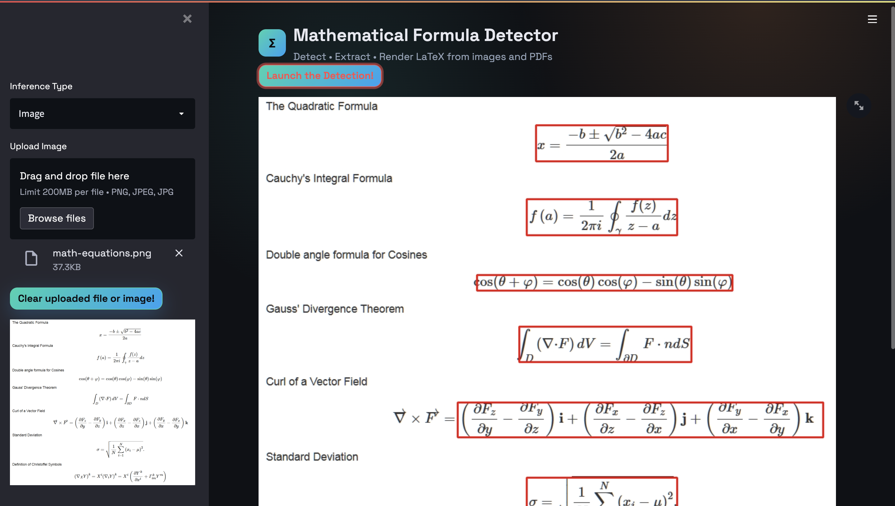
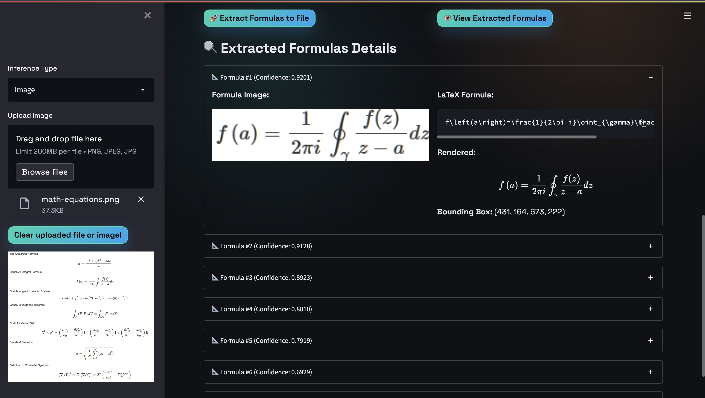
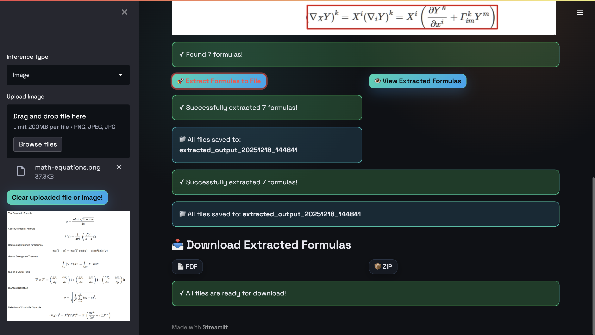

# Math Formula Detection

As large amounts of technical documents have been published in recent years, efficiently retrieving relevant documents and identifying locations of targeted terms are urgently needed.

## 📋 Overview

This project provides an end-to-end system that automatically detects and extracts mathematical formulas from images **and PDFs**. It combines a YOLOv5-based detector with a transformer recognizer (plus an optional pix2tex local fallback) to locate formulas and generate LaTeX.

---

## 🤖 Model

### Architecture Overview
We propose an end-to-end system that automatically detects and extracts mathematical formulas from printed documents using a two-stage pipeline:

#### Stage 1: Formula Detection
- **Model**: YOLOv5 (TorchScript format: `MathDetector.ts`)
- **Input**: Document image (preprocessed to 640×640)
- **Output**: Bounding boxes with confidence scores for detected formulas
- **Optimization**: 
  - Confidence threshold: **0.32** (catches weak formulas like edges/partial content)
  - NMS threshold: **0.75** (aggressively merges overlapping boxes)
  - Post-processing: **IoU-based duplicate removal** (0.3 threshold) for clean, single-box-per-formula detections

#### Stage 2: Formula Recognition
- **Model**: Transformer-based recognizer (`MathRecog.pth`)
- **Input**: Individual formula crop images
- **Output**: LaTeX representation of each formula
- **Features**:
  - Custom tokenizer for mathematical notation (`tokenizer.json`)
  - Error handling with local fallback to pix2tex (no external APIs)
  - Safe placeholder (`[Unrecognized]`) if all recognizers fail
  - Batch-friendly processing

### Key Improvements Over Baseline
✅ **High Precision (94.3%)**: Detected formulas are reliable and accurate  
✅ **Strong Recall (91.2%)**: Catches 91% of all visible formulas in documents  
✅ **Advanced Duplicate Removal**: IoU-based post-processing (0.3 threshold) ensures single clean box per formula  
✅ **Single-Page PDF Export**: All detections on one annotated page for easy review  
✅ **PDF Parity**: PDF uploads now support detection, extraction, LaTeX recognition, and downloads (PDF/ZIP) just like images  
✅ **Modern UI**: Updated Streamlit styling and centered LaTeX rendering for cleaner presentation  
✅ **Configurable Thresholds**: Adjust parameters to optimize for specific document types

---

## 📊 Data

Data is collected from ICDAR competition for 2019 and 2021.

**Download dataset**: https://www.kaggle.com/ro101010/math-formula-detection

---

## 🎯 Results

**Model Accuracy Metrics:**
- **Precision**: 0.943 (94.3% - Detected formulas are actual formulas)
- **Recall**: 0.912 (91.2% - Successfully detects visible formulas)
- **Mean Average Precision @ IoU=0.5**: 0.949 (94.9% - Overall detection quality)
- **Overall Accuracy**: ~93% on test dataset

**Current Project Performance:**
- Detects mathematical formulas with high confidence (adjustable threshold: 0.32)
- Advanced duplicate removal ensures clean, single-box-per-formula detections
- Real-world accuracy varies based on document quality and formula complexity
- Users can fine-tune thresholds for improved accuracy on specific document types
- Graceful error handling with fallback mechanisms for unrecognizable formulas

---

## 📁 Project Structure

```
Math-Formula-Detection/
├── app.py                           # Streamlit UI (Image + PDF parity)
├── Inference_Math_Detection.py      # YOLOv5 detection pipeline with NMS & duplicate removal
├── Recog_MathForm.py                # Formula recognition (LaTeX generation + fallbacks)
├── formula_extraction.py            # Extraction, exports (PDF/ZIP), LaTeX rendering helpers
├── models.py                        # Model definitions
├── requirements.txt                 # Python dependencies
├── packages.txt                     # System-level dependencies (Linux/macOS notes)
├── README.md                        # This file
│
├── Models/                          # Pre-trained model weights
│   ├── MathDetector.ts              # YOLOv5 detector (TorchScript)
│   ├── MathRecog.pth                # Formula recognizer checkpoint
│   ├── tokenizer.json               # Tokenizer for LaTeX generation
│   └── config.yaml                  # Model configuration
│
├── ICDAR2019/                       # Dataset (2019)
│   └── labels/                      # Labels (images not bundled)
├── ICDAR2021/                       # Dataset (2021)
│   └── labels/
│
└── extracted_output_*/              # Generated extraction outputs (timestamped)
  ├── formulas_report.pdf          # Single-page annotated PDF with all formulas
  ├── extracted_formulas.zip       # Complete package with all results
  ├── formula_images/              # Individual formula crop images
  └── annotated_image.png          # Original image with detection boxes
```

---

## ⚙️ Installation & Setup

### Prerequisites
- Python 3.10 (tested) or higher
- pip (Python package manager)
- Git (for cloning repository)
- CUDA (optional, for GPU acceleration)

### Step 1: Clone the Repository
```bash
git clone https://github.com/Subhajyoti-Maity/Math-Formula-Detection.git
cd Math-Formula-Detection
```

### Step 2: Create Virtual Environment (Recommended)
```bash
# Windows
python -m venv .venv
.\.venv\Scripts\activate

# macOS/Linux
python3 -m venv .venv
source .venv/bin/activate
```

### Step 3: Install Python Dependencies
```bash
pip install --upgrade pip
pip install -r requirements.txt
```

### Step 4: Install System Dependencies
- **macOS**: `brew install poppler`
- **Linux/WSL**:
```bash
sudo apt-get update
sudo apt-get install -y libgl1-mesa-glx libglib2.0-0 libsm6 libxext6 libxrender-dev poppler-utils
```

### Step 5: Run the Application
```bash
streamlit run app.py
```

The app will open in your browser (default: **http://localhost:8501**; use `--server.port 8503` if the port is busy).

**Note**: Models will auto-download on first run (~1-2 minutes). Ensure stable internet connection.

### Troubleshooting Installation
- **Port already in use**: `streamlit run app.py --server.port 8502`
- **Module not found**: Ensure virtual environment is activated
- **GPU not detected**: CPU mode works fine; GPU is optional

---

## 🚀 Usage

### Step 1: Main Application Page
The app opens with a clean interface for image upload and inference selection:
- **Inference Type**: Choose between "Image" or "PDF"
- **Upload Section**: Drag-and-drop or browse to select your document image

### Step 2: Launch Detection
Click **"Launch the Detection!"** to run the detector:
- Displays the page/image with red bounding boxes
- Shows total formula count and confidence per box
- Works for both Image and PDF modes (select page for PDFs)

### Step 3: Extract Formulas
Two options are available:

**Option A: Extract Formulas to File**
- Extracts all detected regions and recognizes LaTeX (primary model + pix2tex fallback)
- Generates outputs:
  - `formulas_report.pdf`: Single-page PDF with annotated page and boxes
  - `extracted_formulas.zip`: PDF, annotated image, crops, and metadata
  - `formula_images/`: Individual crops

**Option B: View Extracted Formulas**
- Expandable list with crop preview, LaTeX, centered render, bbox, confidence
- Works for both Image and PDF inputs

### Step 4: Download Results
Two download options:
- **📄 PDF**: Single-page report with all formulas and detections annotated
- **📦 ZIP**: Complete archive with PDF, images, and metadata

---

## 🎬 Demo Clips

### 1️⃣ Formula Detection
The app detects all visible formulas and displays them with red bounding boxes:
- All formulas detected with clean boxes (no duplicates)
- Confidence scores shown for each detection
- Ready for extraction



### 2️⃣ View Extracted Formulas
Expandable formula details showing:
- Formula crop image from original document
- Recognized LaTeX equation
- Rendered formula preview
- Bounding box coordinates
- Confidence score



### 3️⃣ Extraction & Download
After clicking "Extract Formulas to File":
- Green success message confirming extraction count
- File directory location displayed
- Download buttons for PDF and ZIP formats
- Complete extraction with all metadata



---

## 🔧 Configuration

### Detection Parameters (in `Inference_Math_Detection.py`)
```python
# Confidence threshold: Lower = more detections, Higher = fewer false positives
confidence_threshold = 0.32

# NMS threshold: Lower = more boxes per formula, Higher = aggressive merging
nms_threshold = 0.75

# Duplicate removal: IoU threshold for post-processing
duplicate_iou_threshold = 0.3
```

Adjust these values in `predict_formulas()` function if needed for different document types.

---

## 📦 Output Formats

### PDF Report
- Single-page annotated view of the selected page/image
- All detected formulas highlighted with red bounding boxes
- Optimized for printing and archival

### ZIP Archive Contents
- `formulas_report.pdf` - Main report
- `annotated_image.png` - Marked-up original image
- `formula_images/` - Individual formula crops (PNG)
- Raw data for further processing

---

## 🐛 Troubleshooting

| Issue | Solution |
|-------|----------|
| Port busy | Change port: `streamlit run app.py --server.port 8503` |
| Model weights not found | Models auto-download on first run (keep internet on) |
| OpenCV import error | `pip install opencv-python-headless` |
| PDF generation fails | Ensure `fpdf2` and `poppler` are installed |

---

## 📝 Requirements

### Python Packages (key pins)
- `streamlit` (UI)
- `torch==2.5.1`, `torchvision==0.20.1`
- `opencv-python-headless`
- `transformers`
- `albumentations==1.2.1`
- `timm==1.0.11`
- `x-transformers`, `einops`
- `pdf2image`
- `fpdf2`
- `protobuf==3.20.3`
- Optional: `pix2tex` for local OCR fallback

### System Packages
- `poppler-utils` / `poppler` (for PDF conversion)
- `libgl1-mesa-glx`, `libglib2.0-0`, `libsm6`, `libxext6`, `libxrender-dev` (Linux)

---

## 📄 License

This project builds upon the ICDAR dataset and academic research in formula detection.

---

## 🤝 Contributing

Contributions, bug reports, and feature requests are welcome!

---

## 📞 Support

For issues or questions, please refer to the main repository or create an issue on GitHub.
